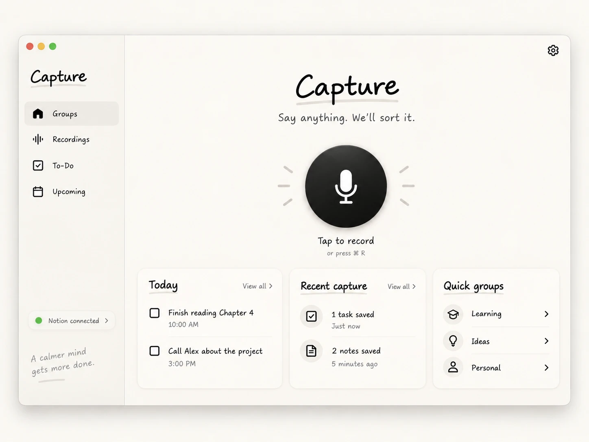

# Capture macOS alpha

Status: Complete

## Outcome + scope

Working private Mac alpha: shortcut → record → local Parakeet transcript → code candidate boundaries + Jev decisions → editable proposal → approve → Notion (captures, audio, library, groups) → approved macOS reminders. Non-goals: brief §1 exclusions (accounts, backend, OAuth, other platforms, calendars, chat, semantic search, summaries, recurring tasks, live captions, other models).

## Repository context

Owners: `lib/` (Dart app + logic), `macos/Runner/` (Swift overlay panel, hotkey, audio, notifications), `test/` (unit/widget/eval fixtures), `PRODUCT.md`, `DESIGN.md`. Starting point = empty `flutter create --platforms=macos --empty` scaffold (commit 9cb35cf) + Hard Eng scaffold (2c0980d).

## Decisions + authorization

Blockers: None
Handoff: Approval
Authority: Autonomous — user brief §2 "proceed to implementation instead of stopping after the plan"; commits on `feature/capture-alpha`; push to the owner's GitHub repo authorized 2026-09-18, made public under MIT at the owner's request the same day; no unrelated Notion changes.

## Acceptance + steps

Each item names its proof. "Live" means an opt-in run with the owner's own keys and a dedicated test Notion page; mocks never count as live proof.

- [x] A1 Candidate boundaries cover every transcript character exactly once (UTF-16 half-open spans + exact excerpt). Proof: `test/features/capture/domain/text/candidate_splitter_test.dart`, `test/eval/candidate_coverage_test.dart` (100% gold boundaries are candidates).
- [x] A2 Jev boundary pass (one Noul per unit) + late-correction Noul; code assembles thoughts; no text is rewritten or lost. Proof: `test/features/capture/repositories/capture_analysis_repository_test.dart`; eval source-loss 0.
- [x] A3 Jev classification pass (group Choice, task/alert/recall Nouls, day/time Choices over code-found candidates) → code-built proposal with review flags; dates resolved in the capture's IANA zone incl. DST gap/overlap. Proof: `test/features/capture/domain/dates/date_resolver_test.dart`, `test/features/capture/domain/proposal/proposal_builder_test.dart`.
- [x] A4 Jev client: pinned `jev-1.13.0`, bounded retries honouring Retry-After, typed failures, no content logged. Proof: `test/features/capture/data/services/jev_http_service_test.dart`, `test/features/capture/data/datasources/jev_remote_datasource_test.dart`.
- [x] A5 Labelled eval (19 synthetic cases) replays 29 recorded live `jev-1.13.0` responses. Proof: `flutter test test/eval/jev_eval_test.dart` (replay; fails on unrecorded requests or source loss). 4 labels were widened after review (pronoun-continuations, bike→Ideas, poorly-punctuated→Ideas, call-mum→chooseTime); known miss: over-split of "He suggested I try Zig" (boundary 0.79).
- [x] A6 Global shortcut (default ⌃⌥ pressed alone, owner decision 2026-09-18; configurable by recording keys then Save) starts/stops recording from any app without Accessibility or Input Monitoring permission; a key held down does not toggle repeatedly. Known limit: a quick ⌃⌥+key combination from another app can also fire it, because key presses in other apps are not visible without that permission. Proof: `test/app/capture_app_test.dart` (shortcut recording) + owner ran ⌃⌥ from another app 2026-09-18.
- [x] A7 Recording writes PCM16 16 kHz mono to disk while recording (durable before stop), shows the charcoal pill with live waveform and timer, hard-stops at 5:00, and discards nothing on crash (draft recovered at launch). Proof: `test/features/capture/presentation/notifiers/capture_flow_notifier_test.dart` (the recorder is asked to stop at 5:00 and its limit event stops the capture; a crashed recording is recovered from the audio on disk, a tap is dropped) + owner saw the pill, waveform and timer 2026-09-18. The recorder itself is Swift, so the PCM writing is proved by the owner's real captures, not a Dart test.
- [x] A8 Local Parakeet-TDT-0.6B-v3 int8 via sherpa_onnx in a background isolate; model downloaded on first run with progress, resume and SHA-256 check into Application Support; CC-BY-4.0 attribution shown. Proof: `test/features/settings/data/datasources/speech_model_datasource_test.dart` (hash/resume) + owner's own voice transcribed and saved 2026-09-18.
- [x] A9 Review card ("Ready to save?", count line, items, No / Yes, save / Edit) near the pill; Edit opens the focused editor (title/body/group/type/due/reminder, split/merge, include/exclude); approval blocked while `approvalProblems` is non-empty. Proof: `test/features/capture/presentation/extensions/review_card_content_test.dart`, `test/features/capture/domain/proposal/proposal_builder_test.dart` (approval problems) + owner review against the references 2026-09-18.
- [x] A10 Settings/onboarding: TypeSafe key and Notion token stored only in Keychain (legacy keychain), validated with `GET /v1/models` and `GET /v1/users/me`; Notion parent page chosen by URL/ID and access checked. Proof: `test/features/settings/repositories/settings_repository_test.dart` (a refused key or token is never stored) + live validation in `test/live/capture_e2e_test.dart`, run by the owner 2026-09-18.
- [x] A11 Notion schema setup under the parent (Capture area page, Groups/Captures/Library data sources, marker) is idempotent; Groups editor edits the Groups data source. Proof: `test/features/settings/data/datasources/notion_workspace_remote_datasource_test.dart` (a second setup finds the area and databases, creating nothing) + live setup and fresh-Mac rediscovery in `test/live/capture_e2e_test.dart`, run by the owner 2026-09-18.
- [x] A12 Approved save: capture page → items → audio upload (M4A, within the workspace upload limit) → mark Saved; per-step progress persisted in SQLite; retry resumes after the last confirmed step and never duplicates (lookup by stable IDs before re-creating). Proof: `test/features/capture/repositories/capture_save_repository_test.dart` (a failed item page resumes on retry, nothing created twice) + live save and re-save without duplicates in `test/live/capture_e2e_test.dart`, run by the owner 2026-09-18.
- [x] A13 Reminders are scheduled only for approved, persisted tasks with a reminder (UNUserNotificationCenter); none before approval. Proof: `test/features/capture/presentation/notifiers/capture_flow_notifier_test.dart`, `test/features/capture/repositories/capture_save_repository_test.dart` + owner allowed notifications and saw a saved task's reminder fire 2026-09-18.
- [x] A14 Main window (Home, Groups, Recordings, To-do, Upcoming) and menu-bar popover (Record, Open app, Settings, Quit) match the approved references with the documented deviations, with truthful empty/error states. Proof: rendered screenshots in `docs/screenshots/`, `test/app/responsive_layout_test.dart` + owner review against the references 2026-09-18.
- [x] A15 README documents setup, keys, model licence, privacy and limits. Proof: `README.md`. Screenshots in `docs/screenshots/` are test-rendered from `test/helpers/sample_workspace.dart`; the ⌃⌥ glyphs were painted in afterwards because `flutter test` has no font fallback.
- [x] A17 A saved note or task can be edited from the app (title, body, group, due, reminder): Notion is updated first, then the local mirror, and the task's reminder is cancelled and rescheduled in the Mac's current time zone. Only the leading body paragraphs are replaced; source quotes and anything else on the page stay. Owner request 2026-09-18. Proof: `test/features/library/` repository + remote tests + owner edited a saved item in the app and saw it in Notion 2026-09-18.
- [x] A18 A saved note or task can be deleted from the app after confirmation: the Notion page moves to Notion's trash (recoverable there), it leaves the local mirror and its reminder is cancelled. Owner request 2026-09-18. Proof: `test/features/library/` tests + owner deleted a saved item in the app and found it in Notion's trash 2026-09-18.
- [x] A19 To-do has a plain text search over saved note and task titles (case-insensitive, local, no AI); bodies are not searched because they are not mirrored locally. Owner request 2026-09-18. Proof: `test/features/library/presentation/notifiers/library_state_test.dart` + `test/app/capture_app_test.dart` (search finds and edits a note).
- [x] A20 Narrow windows use a labelled bottom bar in the sidebar's paper style instead of Material's NavigationBar. Owner request 2026-09-18. Proof: `test/app/responsive_layout_test.dart` (320 px to 4K, no overflow) + re-rendered `docs/screenshots/phone-home.png` and `phone-upcoming.png`, inspected.
- [x] A21 Capture has its own app icon: the record button (black disc, cream mic, pencil rays) on a cream macOS squircle, legible down to 16 px. Owner request 2026-09-18. Proof: `macos/Runner/Assets.xcassets/AppIcon.appiconset/`, inspected at 16 to 1024 px; `flutter build macos --release` builds with it.
- [x] A22 Every merge to `main` builds Capture.app in the protected `release` environment, waits for the `hard-eng` check on that commit, signs it with the owner's Developer ID and notarises the DMG when those secrets exist (ad-hoc otherwise), and publishes it as the latest GitHub release (shown on the repository home page); pull requests build and pack the DMG without publishing. Signing material lives only in GitHub environment secrets. Owner request 2026-09-18. Proof: `.github/workflows/release.yml` passes actionlint and zizmor; the PR #2 `dmg` job built and packed the DMG on a GitHub macOS runner (6 min 18 s); the build and `hdiutil` steps also ran locally (114 MB app, 47 MB DMG, checksum VALID). The first release is recorded under Delivery.
- [x] A23 Capture ships as Afenso Ltd's app: bundle ID `com.afenso.capture` and "Copyright © 2026 Afenso Ltd. All rights reserved." in About and Get Info; Afenso Ltd holds the MIT copyright. macOS treats it as a new app, so the owner re-enters both keys, re-grants the microphone and notifications, and the speech model downloads again; nothing is migrated from `com.abid.capture`. Owner request 2026-09-18. Proof: `flutter build macos --release` Info.plist shows `CFBundleIdentifier` com.afenso.capture and that copyright; `git grep com.abid` finds nothing.
- [x] A24 Each release's DMG file is named `Capture-<version>.dmg`, not only labelled so. Owner request 2026-09-18. Proof: `.github/workflows/release.yml` passes actionlint and zizmor; the next release's asset name is checked after merge.
- [x] A25 The newest build is the repository's latest release, shown in the home page sidebar, and the README's Download link opens it. Owner request 2026-09-18. Proof: `gh api repos/sgaabdu4/capture/releases/latest` returns v0.1.0-alpha.6 after it was promoted; `.github/workflows/release.yml` publishes with `--latest` and passes actionlint and zizmor.
- [x] A26 Linking the Capture page itself, not the page holding it, reuses that page and its databases instead of creating a second Capture page inside it. Found by the owner on 2026-09-18 when the notarised build nested a new Capture page. Proof: `test/features/settings/data/datasources/notion_workspace_remote_datasource_test.dart` (fails on the old code with 8 pages and databases created; passes with 4).
- [x] A27 Capture updates itself. Sparkle checks the latest release's `appcast.xml` daily and when "Check for updates" is pressed; a newer build turns the small link at the page's bottom right into "New version · Download now", and Sparkle's window installs it and relaunches Capture after checking the Afenso signature and the update's EdDSA signature. Releases carry their run number as the build number Sparkle compares, the feed is signed with the `SPARKLE_PRIVATE_KEY` release secret (its key also stays in the owner's login keychain), and the sandbox gains only Sparkle's installer mach-lookup exception. Debug builds never update. The first build with the updater is installed by hand. Owner request 2026-09-18; Sparkle chosen over the `auto_updater` package (CocoaPods only, unmaintained) and a download-only link. Proof: `test/app/capture_app_test.dart` (the link checks for updates and offers the download once one is found); locally, a Developer ID build 11 signed as the workflow signs found build 12 in a signed feed on its own, installed it through Sparkle's sandboxed installer and relaunched as build 12 with a valid Afenso signature.
- [x] A28 The update link shows only once Sparkle finds a newer release; there is no "Check for updates" link. Sparkle still checks daily on its own and opens its window when it finds one; the link stays as the reminder after "Remind Me Later". Owner request 2026-09-18. Proof: `test/app/capture_app_test.dart` (no link at launch, fails on the A27 code; the link appears after Sparkle's event and opens Sparkle).
- [x] A29 Dependencies stay current and ship on their own. Dependabot opens one pull request a week with every Dart package and GitHub Action version update, and a security update as soon as its advisory lands. Version updates wait a 7-day cooldown; security updates do not. Every hour the `Dependabot merge` workflow records each open Dependabot pull request in this plan (Hard Eng requires it), pushes and turns on auto-merge with the owner's fine-grained `DEPENDABOT_TOKEN`, kept in the `dependabot` environment (GITHUB_TOKEN pushes and merges start no workflows, and runs Dependabot triggers cannot read environment secrets); a `main` ruleset requires `hard-eng` and `dmg`, so it merges only once they pass, and the merge publishes a release. The `release` environment no longer needs the owner's approval, so every merge to `main` publishes; Sparkle still asks before installing. Not covered: Sparkle itself, pinned in the Xcode project's Swift packages, which Dependabot cannot update; two Dependabot pull requests open at once both append here, so the second conflicts and needs `@dependabot recreate`. Owner request 2026-09-18; the owner chose the recording workflow over a Hard Eng exemption. Proof: actionlint and zizmor pass; a PR changing only an action pin fails Hard Eng's plan check without the line and passes with it; the first Dependabot pull request's merge and release are recorded under Delivery.
- [x] A30 Settings ends with Reset Capture. After a confirmation it removes both keys from the Keychain, empties the local database (captures, the Notion page link, the shortcut, groups and the synced list), deletes the recordings folder and cancels every scheduled or shown reminder, keeps the speech model, registers the standard shortcut and opens Home on the setup steps. It is disabled while a capture is in progress. Owner request 2026-09-19 (reminder cancelling added the same day), after resetting by hand needed Terminal and Full Disk Access. Proof: `test/app/capture_app_test.dart` resets a set-up app with a capture, a recording and a model marker on disk: both keys are gone, every reminder is cancelled, the recordings folder is gone, the model marker stays, Home shows the setup steps with both steps needed, and Recordings is empty; the test fails if reset deletes the whole support folder or skips cancelling reminders.
- [x] A16 Full E2E: shortcut in another app → speak → review → approve → Notion rows + audio + reminder. Proof: owner's live runs recorded under Verification.

Documented deviations from the mockups: shortcut shown as the configured keys (default ⌃⌥, not ⌘R, which apps already use); no Weekly summary; no nav item selected on Home; no active mic/waveform while reviewing; count line on the review card; truthful empty states instead of sample data; below 840 px wide a bottom navigation bar replaces the sidebar, content is capped at 1280 px and centred, and the window's minimum size is 320×480 (owner request 2026-09-18, proof `test/app/responsive_layout_test.dart`).

## Baseline + execution

Result: Passed
Evidence: `python3 .hooks/hard-eng.py check --plan-stage Draft` on `feature/capture-alpha` at b263efb: all 12 checks PASS (lockfile, vulnerabilities, format, security, types-lint, import-boundaries, tests, dead-code-duplicates, performance, secrets-files, secrets-history, strict-types-lint). Main baseline repair: `features/gate-adaptation/PLAN.md`.
Execution: Single builder; slices per brief §18.

## Risks + recovery

- Jev thresholds are provisional (`lib/domain/jev/thresholds.dart`); uncertain bands raise review flags rather than guessing. Recovery: tune on the eval set only with new labelled cases.
- 1.4 GB model memory: recogniser loaded lazily in an isolate and released after idle. Recovery: fall back to a clear error, audio kept.
- Notion free-plan limits (5 MiB uploads, 1000 blocks): read limits from `/v1/users/me`, encode ≤64 kbps AAC, show a clear error on block limit; capture stays local and retryable.
- Partial saves: every Notion step is persisted before the next; retries query by Capture ID / Item ID first.

## ux_reference

Result: Passed
Evidence: The owner supplied four approved Capture reference images in the build conversation. They are stored in `docs/design/reference/` (`main-window.png`, `menu-popover.png`, `recording-pill.png`, `review-card.png`) and were inspected as the visual target. The direction is settled; the only changes are the documented deviations under Acceptance. Rendered-vs-reference proof of the built UI remains acceptance item A14.
Surface: New — macOS main window (`lib/features/*/presentation`, shell `lib/features/shell`), native overlay and menu (`macos/Runner/Native`), tokens in `lib/core/theme`
Before: N/A — new app; the starting point was an empty `flutter create` scaffold with no prior UI
Proposed: 
Capture: Owner-provided reference images (PNG), checked into `docs/design/reference/`; opened and compared during theme and widget work.
Review: Covers Home, Groups, Recordings, To-do, Upcoming, Settings, the editor, the review card, the pill and the menu. Deviations: the ⌃⌥R shortcut label, no Weekly summary, no selected nav item on Home, no active waveform while reviewing, a count line on the review card, and truthful empty states.

## Verification

Result: Passed
Evidence: 2026-09-18, owner-reported: `E2E_LIVE=1 … flutter test test/live/capture_e2e_test.dart` passed both live tests (spoken capture → review → Yes → Notion capture, items and audio → reminder requested → re-save duplicates nothing; fresh Mac finds the same setup). In the real app the owner ran ⌃⌥ from another app with their own voice through to Notion, edited and deleted a saved item, and saw a saved task's reminder notification fire. `flutter test`: 108 passed, 2 live skipped; `flutter analyze`: no issues.
E2E: Passed — owner ran ⌃⌥ from another app → own voice → review → Yes, save → Notion capture, items and audio → reminder notification fired, 2026-09-18.
Delivery target: PR
Delivery: Pending — the alpha (A1 to A19) merged to `main` by the owner through https://github.com/sgaabdu4/capture/pull/1 on 2026-09-18 as 3b26239; its PR CI run passed in 338 s and the `main` CI run passed. A20 to A22 merged through https://github.com/sgaabdu4/capture/pull/2 as 73a1a16; the owner approved the `release` deployment and the Release workflow published v0.1.0-alpha.3 (release and tag deleted at the owner's request on 2026-09-18), ad-hoc signed because no signing secrets were set yet (downloaded DMG: checksum VALID, holds Capture.app and the Applications link, `Signature=adhoc`). A23 and A24 merged through https://github.com/sgaabdu4/capture/pull/3 as e0f2397; the owner approved the deployment and the Release workflow published v0.1.0-alpha.6 (release and tag deleted at the owner's request on 2026-09-18), signed and notarised: downloaded, the DMG and the app both pass `spctl` as "Notarized Developer ID" from Developer ID Application: Afenso Ltd (HJ88J296A6), the ticket is stapled, and the app is com.afenso.capture with the Afenso Ltd copyright. It was then promoted to the latest release. A25 merged through https://github.com/sgaabdu4/capture/pull/4; the Release workflow then published https://github.com/sgaabdu4/capture/releases/tag/v0.1.0-alpha.8 as Latest, notarised (`spctl`: Notarized Developer ID, Afenso Ltd). A26 merged through https://github.com/sgaabdu4/capture/pull/5 as 19b0a6b; the Release workflow published https://github.com/sgaabdu4/capture/releases/tag/v0.1.0-alpha.10 as Latest, notarised (`spctl`: Notarized Developer ID, Afenso Ltd; stapled). A27 merged through https://github.com/sgaabdu4/capture/pull/6 as 36207a1; the Release workflow published https://github.com/sgaabdu4/capture/releases/tag/v0.1.0-alpha.12 as Latest with `appcast.xml`: the DMG and its app pass `spctl` as Notarized Developer ID from Afenso Ltd, the ticket is stapled, the app is build 12 with the expanded Sparkle mach-lookup entitlement and no `get-task-allow`, Sparkle's Autoupdate is signed by Afenso Ltd, and the feed lists build 12 with an EdDSA signature and a working `releases/latest/download/appcast.xml` URL. The owner's Mac ran alpha.12, installed by hand. https://github.com/sgaabdu4/capture/pull/7 (de2e9aa) published v0.1.0-alpha.14, and the owner's alpha.12 found it on its own and installed it through Sparkle's window (Install Update, then Install and Relaunch); the relaunched app is build 14, notarised and signed by Afenso Ltd.
