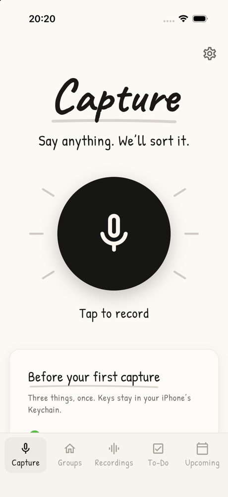
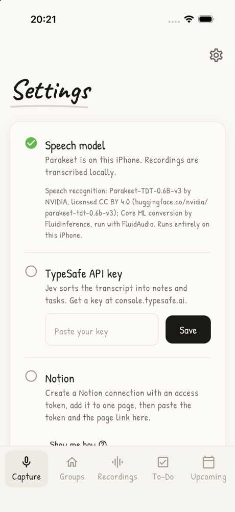
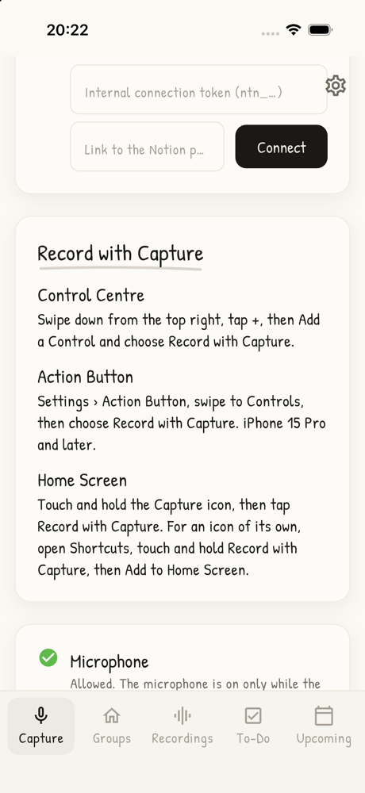
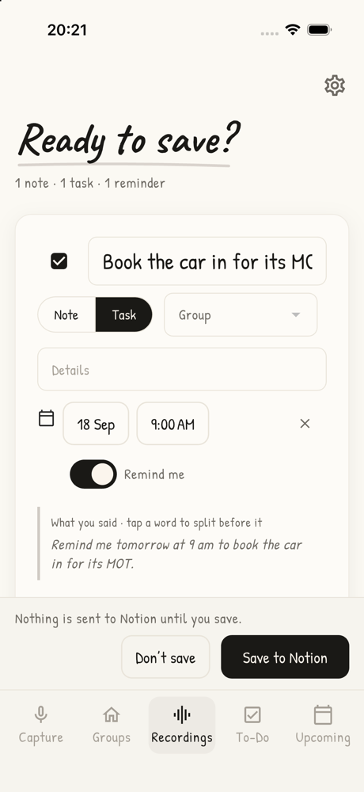

<div align="center">


# Capture

**Say anything. We'll sort it.**

A private Mac voice diary. Press a shortcut, speak, and your thoughts land in Notion as notes, tasks and reminders.


</div>

## Watch it work

A spoken capture sorted into notes, tasks and reminders, then how to set Capture up. Turn the sound on.

https://github.com/user-attachments/assets/bf1d3b83-6699-4a02-b5be-1f403e4bd1b2

## How it works

```
⌃⌥ → speak → ⌃⌥ → transcribed on your Mac → sorted by Jev → you review → Notion + Mac reminders
```

- **Local speech.** Parakeet transcribes on your Mac or iPhone. Audio never goes to an AI service.
- **Sorted, not rewritten.** Jev (TypeSafe) splits what you said into separate thoughts and files each one into your groups. Titles and bodies come from your own words.
- **You approve first.** Nothing reaches Notion until you press **Yes, save**, unless you turn on auto-save.
- **Notion is the library.** Captures, notes, tasks and the recording are saved under one Notion page you choose.
- **Reminders.** Approved tasks with a time become macOS notifications.

<table>
  <tr>
    <td></td>
    <td></td>
  </tr>
  <tr>
    <td align="center">Review before anything is saved</td>
    <td align="center">Search, edit or delete what's saved</td>
  </tr>
</table>

## Download

[](https://github.com/sgaabdu4/capture/releases/latest)

**[Download the latest Capture DMG](https://github.com/sgaabdu4/capture/releases/latest)**, open it and drag Capture into Applications. Every merge to `main` that changes the app publishes a new release, numbered as the next patch version (1.0.1, 1.0.2, …). A minor or major release comes from raising the version in `pubspec.yaml`.

Releases are signed with a Developer ID and notarised by Apple once the signing secrets are set. An unsigned build says so in its release notes: open **System Settings → Privacy & Security** and choose **Open Anyway** for Capture.

## Setup

You need macOS 12 or later, a [TypeSafe](https://console.typesafe.ai) API key, and a Notion workspace. To build from source you also need Flutter 3.47 or later:

```bash
git clone <this repo> && cd capture
flutter pub get
flutter run -d macos
```

Then, once, in the app:


1. **Speech model.** Press **Download** (≈670 MB, checked and resumable).
2. **TypeSafe key.** Paste it. It's stored in the macOS Keychain.
3. **Notion.** Create an internal connection, add it to one page, then paste the token and the page link. **Show me how** walks through it with pictures. Capture creates its Groups, Captures and Library databases under that page.

## Use

| Do | How |
| --- | --- |
| Record | Press **⌃⌥** on its own and let go, in any app. Press again to stop. Or click the mic. |
| Review | A card appears: **Yes, save**, **Edit** or **No**. |
| Find | **To-Do** searches every saved title. |
| Edit | Tap any note or task to change its title, details, group, date or reminder. |
| Delete | **Delete**, then **Move to Notion trash**. You can restore it from Notion's trash. |
| Groups | Name and describe your groups. Jev uses the descriptions to file things. |
| Shortcut | **Settings → Record shortcut**, press the keys, then **Save shortcut**. |
| Auto-save | **Settings → Save to Notion automatically**. Recordings save without the card and a notification says what was saved. The card still appears when something needs a look. |

You can record before setup is finished. The recording waits in **Recordings** and **Retry** sorts it once setup is done.

Narrow the window and the sidebar becomes a bottom bar. On large screens the content stays centred.

<p align="center">
  
  &nbsp;
  
</p>

## iPhone

Capture also runs on iPhone (iOS 26 or later) with the same pages, review card and Notion library. Setup is the same three steps; the speech model is the Core ML version (≈483 MB), and keys are stored in the iPhone's Keychain.

**Record with Capture** opens Capture straight into recording. Add it once, from **Settings → Record with Capture** in the app:

- **Control Centre.** Swipe down from the top right, tap **+**, then **Add a Control** and choose Record with Capture.
- **Action Button** (iPhone 15 Pro and later). **Settings → Action Button**, swipe to **Controls**, then choose Record with Capture.
- **Home Screen.** Touch and hold the Capture icon. For an icon of its own, open **Shortcuts**, touch and hold Record with Capture, then **Add to Home Screen**.

Stop with the pill's stop button or the mic. Opening Capture normally never starts a recording.

<p align="center">
  
  &nbsp;
  
  &nbsp;
  
  &nbsp;
  
</p>

Builds come from Codemagic: `ios-validate` builds every pull request. Each release tag starts `ios-testflight`, which builds the same version, uploads it to TestFlight for internal testing, submits it to App Store review, and releases it once Apple approves. Pull requests that change the app give the App Store's "What's New" text under a `## What's New` heading in their description.

## Privacy

- Audio is recorded and transcribed on your Mac or iPhone.
- Only the transcript text and your group descriptions go to TypeSafe (Jev) for sorting.
- Approved notes, tasks and the recording go to your Notion page. Drafts stay on your device.
- Keys live in the Keychain. No analytics, and no logs of your words.
- Needs microphone access only: no Accessibility or Screen Recording permission.

## Limits

- Private single-user alpha, Mac and iPhone only (no iPad layout). Captures are up to 5 minutes, and dates are English only.
- Search matches titles, not details.
- An edit replaces only the details Capture wrote, meaning the first paragraphs on the Notion page. Quotes and anything else you added there stay.
- Pressing ⌃⌥ with another key quickly in another app can also start a capture.

## Development

```bash
flutter test
```

The live end-to-end test is opt-in. It uses your own keys and a dedicated test page in Notion:

```bash
E2E_LIVE=1 TYPESAFE_API_KEY=… NOTION_TOKEN=… NOTION_PAGE=<test page link> flutter test test/live/capture_e2e_test.dart
```

## Credits

- Speech recognition: [Parakeet-TDT-0.6B-v3](https://huggingface.co/nvidia/parakeet-tdt-0.6b-v3) by NVIDIA, licensed CC BY 4.0. The ONNX int8 conversion is from the k2-fsa [sherpa-onnx](https://github.com/k2-fsa/sherpa-onnx) project; on iPhone, the [Core ML conversion](https://huggingface.co/FluidInference/parakeet-tdt-0.6b-v3-coreml) by FluidInference runs with [FluidAudio](https://github.com/FluidInference/FluidAudio) (Apache 2.0).
- Fonts: Caveat and Patrick Hand, both under the SIL Open Font License (see `assets/fonts`).
- Screenshots use sample data.

## License

Code: [MIT](LICENSE). The model and fonts keep their own licences, listed above.
