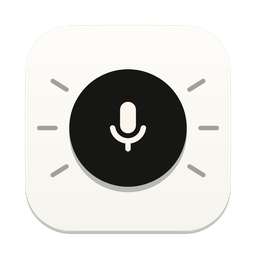
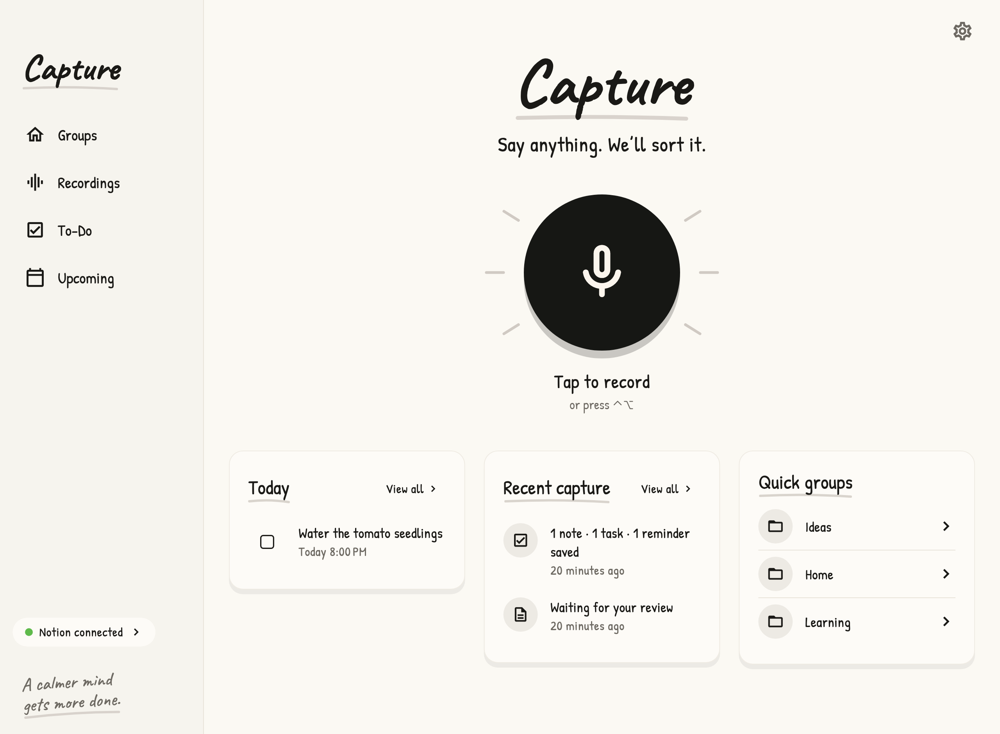
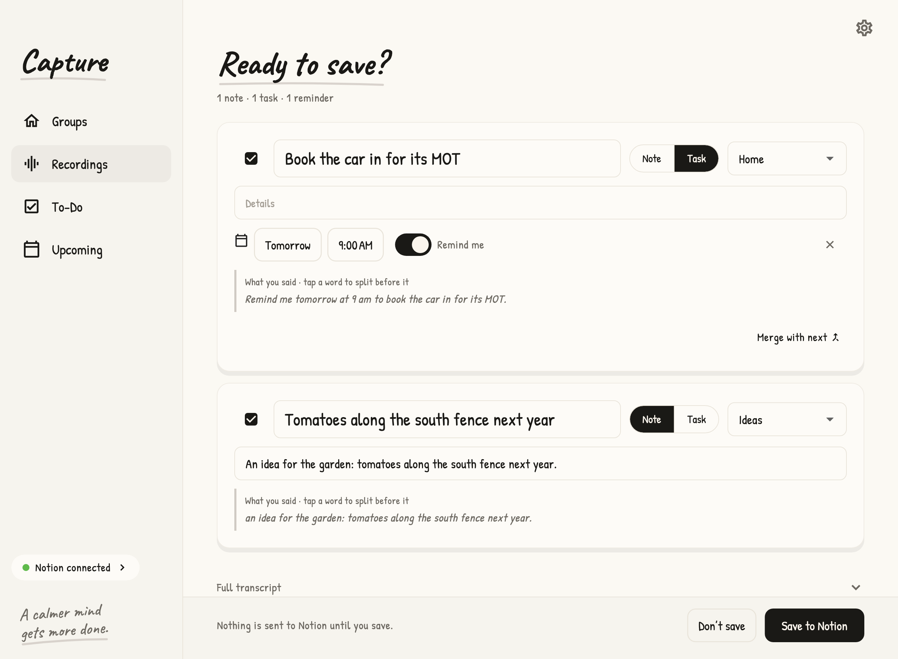
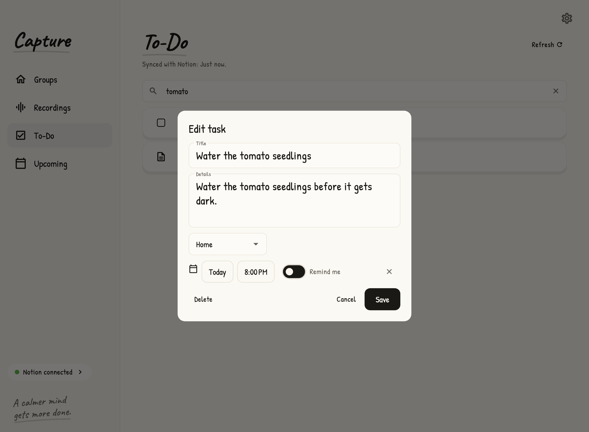
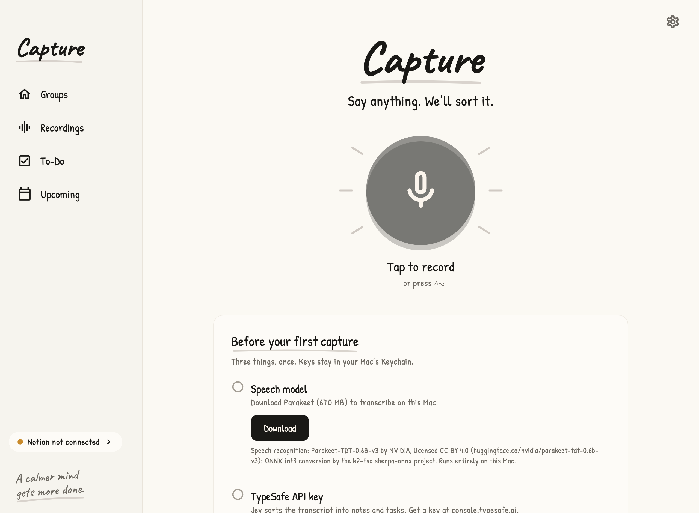
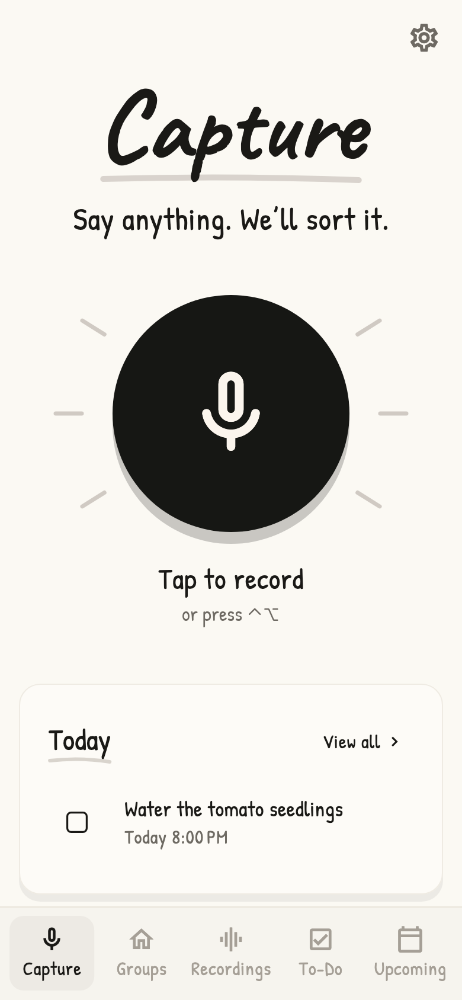
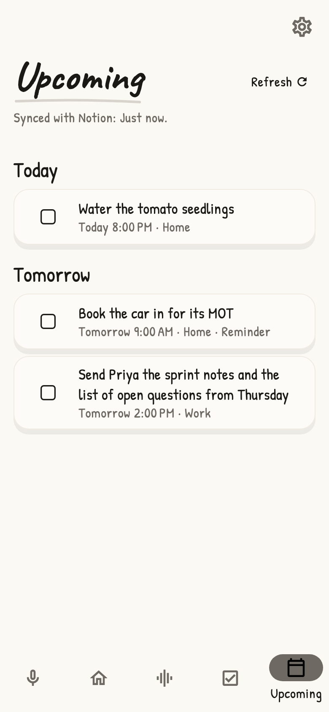

<div align="center">



# Capture

**Say anything. We'll sort it.**

A private Mac voice diary. Press a shortcut, speak, and your thoughts land in Notion as notes, tasks and reminders.



</div>

## How it works

```
⌃⌥ → speak → ⌃⌥ → transcribed on your Mac → sorted by Jev → you review → Notion + Mac reminders
```

- **Local speech.** Parakeet transcribes on your Mac. Audio never goes to an AI service.
- **Sorted, not rewritten.** Jev (TypeSafe) splits what you said into separate thoughts and files each one into your groups. Titles and bodies come from your own words.
- **You approve first.** Nothing reaches Notion until you press **Yes, save**.
- **Notion is the library.** Captures, notes, tasks and the recording are saved under one Notion page you choose.
- **Reminders.** Approved tasks with a time become macOS notifications.

<table>
  <tr>
    <td></td>
    <td></td>
  </tr>
  <tr>
    <td align="center">Review before anything is saved</td>
    <td align="center">Search, edit or delete what's saved</td>
  </tr>
</table>

## Setup

You need macOS 12 or later, Flutter 3.47 or later, a [TypeSafe](https://console.typesafe.ai) API key, and a Notion workspace.

```bash
git clone <this repo> && cd capture
flutter pub get
flutter run -d macos
```

Then, once, in the app:



1. **Speech model.** Press **Download** (≈670 MB, checked and resumable).
2. **TypeSafe key.** Paste it. It's stored in the macOS Keychain.
3. **Notion.** Create an internal connection, add it to one page, then paste the token and the page link. **Show me how** walks through it with pictures. Capture creates its Groups, Captures and Library databases under that page.

## Use

| Do | How |
| --- | --- |
| Record | Press **⌃⌥** on its own and let go, in any app. Press again to stop. Or click the mic. |
| Review | A card appears: **Yes, save**, **Edit** or **No**. |
| Find | **To-Do** searches every saved title. |
| Edit | Tap any note or task to change its title, details, group, date or reminder. |
| Delete | **Delete**, then **Move to Notion trash**. You can restore it from Notion's trash. |
| Groups | Name and describe your groups. Jev uses the descriptions to file things. |
| Shortcut | **Settings → Record shortcut**, press the keys, then **Save shortcut**. |

Narrow the window and the sidebar becomes a bottom bar. On large screens the content stays centred.

<p align="center">
  
  &nbsp;
  
</p>

## Privacy

- Audio is recorded and transcribed on your Mac.
- Only the transcript text and your group descriptions go to TypeSafe (Jev) for sorting.
- Approved notes, tasks and the recording go to your Notion page. Drafts stay on your Mac.
- Keys live in the macOS Keychain. No analytics, and no logs of your words.
- Needs microphone access only: no Accessibility or Screen Recording permission.

## Limits

- Private single-user alpha, macOS only. Captures are up to 5 minutes, and dates are English only.
- Search matches titles, not details.
- An edit replaces only the details Capture wrote, meaning the first paragraphs on the Notion page. Quotes and anything else you added there stay.
- Pressing ⌃⌥ with another key quickly in another app can also start a capture.

## Development

```bash
flutter test
```

The live end-to-end test is opt-in. It uses your own keys and a dedicated test page in Notion:

```bash
E2E_LIVE=1 TYPESAFE_API_KEY=… NOTION_TOKEN=… NOTION_PAGE=<test page link> flutter test test/live/capture_e2e_test.dart
```

## Credits

- Speech recognition: [Parakeet-TDT-0.6B-v3](https://huggingface.co/nvidia/parakeet-tdt-0.6b-v3) by NVIDIA, licensed CC BY 4.0. The ONNX int8 conversion is from the k2-fsa [sherpa-onnx](https://github.com/k2-fsa/sherpa-onnx) project.
- Fonts: Caveat and Patrick Hand, both under the SIL Open Font License (see `assets/fonts`).
- Screenshots use sample data.

## License

Code: [MIT](LICENSE). The model and fonts keep their own licences, listed above.
